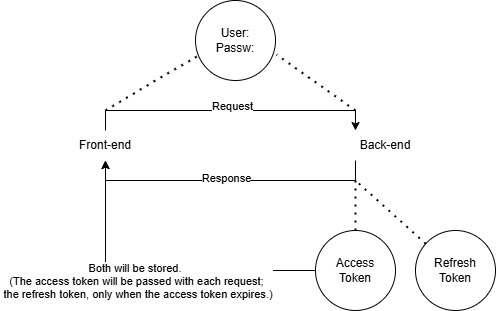

# Django & React - Project

## A simplified view of full-stack development, learning to connect different frameworks and languages.
### How JWT Tokens Works?

> *JWT is used for authentication and authorization every time we access a website.*

The front end is separate from the back end, so every time the front end sends a request, the back end needs to know who is sending the request and what permissions they have.

So, we send a token with each request to the back end, and that token is decoded and interpreted to represent a specific set of permissions.

***
### Building the Backend

#### Create a Virtual Environment
- `python3 -m venv env`
- `source env/bin/activate`

### Install Dependencies
Create a file named "requirements.txt" and copy the contents of "backend/requirements.txt" into it.

To install all dependencies at once, run the following command in the terminal:

`pip install -r requirements.txt`

(If necessary, adjust the path to "requirements.txt".)

### Create a new Django Project
`django-admin startproject backend`

This will create a new directory with initial files in it. If you want a different name, simply change the name 'backend' when you run the command in the terminal.

### To organize the backend, create a dedicated directory for the API. To do this:
- `cd backend`
- `python manage.oy startapp api` 
> In backend/backend/settings.py, we need to add configuration settings that will simplify database connection and enhance ORM functionality.
### Django Settings
`from datetime import timedelta`   
`from dotenv import load_dotenv`  
`import os`  

Call the `load_dotenv()` function after all imports. 

Scroll down and locate ALLOWED_HOST=[]. Modify it to `ALLOWED_HOST=[*]`. This configuration permits any host to serve the Django application.

Add this code below; it helps us with JWT.

<code> 
REST_FRAMEWORK = {
  "DEFAULT_AUTHENTICATION_CLASSES": (
    "rest_framework_simplejwt.authentication.JWTAuthentication",
  ),
  "DEFAULT_PERMISSION_CLASSES": [
    "rest_framework.permissions.IsAuthenticated",
  ],
}

</code>

The minutes represent the token's active duration. The days represent the refresh token's expiration time. Add this code below too.

<code> 
SIMPLE_JWT = {
  "ACCESS_TOKEN_LIFETIME": timedelta(minutes=30),
  "REFRESH_TOKEN_LIFETIME": timedelta(days=1),
}

</code>

Scroll down and add this lines into `INSTALLED_APPS`
- `'api',`
- `'rest_framework',`
- `'corsheaders'`

Scroll down again and add this into `MIDDLEWARE`
- `'corsheaders.middleware.CorsMiddleware',`

Finally, scroll to the botton and add this

`CORS_ALLOW_ALL_ORIGINS = True`  
`CORS_ALLOWS_CREDENTIALS = True`

### Creating Migrations
inside backend directory  
`python manage.py makemigrations`  
Create the migrations  
`python manage.py migrate`  
Apply the migrations

Than when everthings is setup, you can run by simply run this code on terminal:  
`python manage.py runserver`
